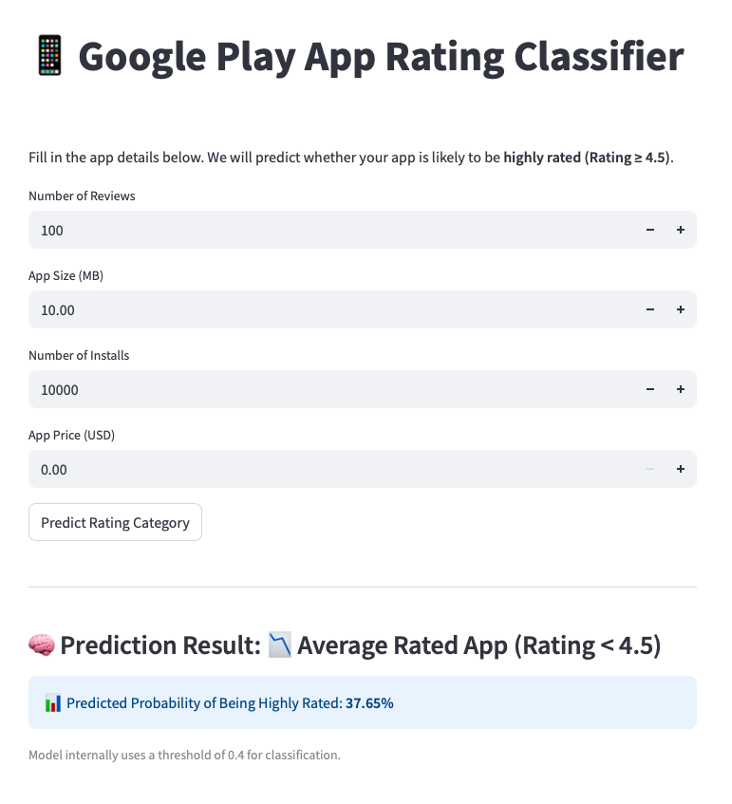

# Google Play Store High Rating Predictor 🎯

This project predicts whether a mobile app will be highly rated (Rating ≥ 4.5) based on features such as reviews, size, installs, and pricing. Built using a tuned Random Forest Classifier, deployed with Streamlit.

## 🔍 Project Overview
- Dataset: [Kaggle Google Play Store Dataset](https://www.kaggle.com/datasets/lava18/google-play-store-apps)
- Classification Goal: Predict whether an app is highly rated
- Final Model: RandomForestClassifier (class_weight='balanced', tuned via RandomizedSearchCV)

## 📁 Structure
- `notebooks/assignment3_final.ipynb` – Full notebook with EDA, modeling, tuning, SHAP analysis
- `streamlit_app/` – Streamlit UI for real-time prediction
- `data/` – Original dataset

## 🛠 How to Run Streamlit App
```bash
cd streamlit_app/
pip install -r ../requirements.txt
streamlit run streamlit_app.py

## 🖼️ Screenshot
